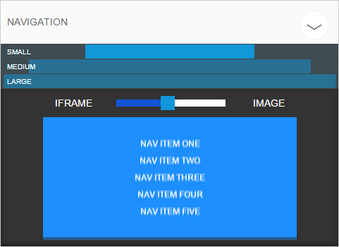

# grunt-style-guide (under development)

A Grunt plugin for Geta [style-guide](https://github.com/hkvalvik/style-guide).

Lets you visually compare front-end components with design sketches.

## Installation

    npm install git://github.com/hkvalvik/grunt-style-guide.git --save

* The package has not yet published to NPM, hence the reference to GitHub.

## Example grunt configuration:

    module.exports = function(grunt) {

        grunt.initConfig({

            'style-guide': {

                dist: {

                    // Point to a directory containing subdirectories with design files:
                    src: 'design',

                    // Save the generated json at this location.
                    // It will contain references to all the design files in the src folder.
                    dest: 'style-guide.json'
                }
            }
        });

        grunt.loadNpmTasks('grunt-style-guide');
    };

### Options

#### src

Should point to a directory containing design sketches in jpg, png or gif format.

For example, if you are creating a navigation component and a carousel, the directory structure might look like this:

    design
    │
    └───navigation
        │   small.jpg
        │   medium.jpg
        │   large.jpg
        │
        └─carousel
        │   tiny.jpg
        │   small.jpg
        │   medium.jpg
        │   large.jpg
        │   giant.jpg

[Another example](https://github.com/hkvalvik/style-guide/tree/master/tests/fixtures)

### dest

The style guide will generate a json file containing information about the design sketches.

The dest option let's you specify where to save the json file.

## Example client-side configuration:

    <!-- Include jQuery (not included in this package) -->
    

    <!-- Include the style-guide plugin -->
    

    <!-- Include the user interface styles -->
    <link rel="stylesheet" href="/node_modules/grunt-style-guide/node_modules/style-guide/client.min.css">

    <!-- Initialize the plugin. -->
    <!-- The dataFile option must point to the dest path in the grunt configuration. -->
    <!-- The imageResolver option is optional; use it if you need to rewrite image paths. -->
    

To associate an element with a directory of design sketches, use the `data-sg-component` attribute:

    <nav class="navigation" data-sg-component="navigation"> ... </nav>

## Example of a rendered style-guide component:

In the example above, the "navigation", "small", "medium" and "large" labels, as well as the image layer, come from this directory structure:

    navigation
    │
    │   small.jpg
    │   medium.jpg
    │   large.jpg

